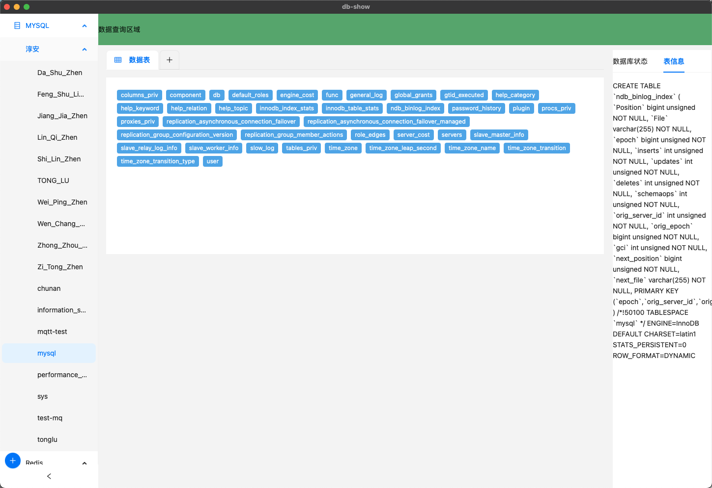

# All in One Show 

## 介绍

你是否厌倦了为不同的数据源使用不同的可视化工具？我们理解这个挑战，因此决定创造一个一体化的数据管理平台，覆盖各种数据库和数据存储工具，为用户提供更统一、更高效的数据操作和可视化体验。

## 项目概况

我们的项目采用 [Tauri](https://tauri.app/) 作为开发框架，利用现代化的前端技术（VUE3 + ant-design-vue）和高性能的后端开发语言（Rust）来构建一体化的数据管理平台。

## 技术栈

### Tauri

[Tauri](https://tauri.app/) 是一个用于构建现代桌面应用程序的框架。通过结合 Web 技术和本地代码，Tauri 提供了一种灵活而高效的开发方式，使得构建桌面应用变得更加简单和直观。

### VUE3 + ant-design-vue

前端部分采用了 VUE3 框架和 ant-design-vue 组件库。VUE3 是一种灵活且高效的 JavaScript 框架，而 ant-design-vue 提供了丰富实用的 UI 组件，使用户可以享受流畅的、符合设计规范的用户界面。

### Rust

Rust 是一种系统级编程语言，以其内存安全、并发性和高性能而著称。我们选择 Rust 作为后端语言，以确保平台的稳定性和高效性。Rust 的强大工具和生态系统为我们提供了构建安全可靠软件的理想环境。

## 闭源状态

目前，我们的项目仍然处于闭源状态，这是为了确保在正式发布之前有足够的时间进行测试和优化。我们致力于提供最好的用户体验，因此闭源阶段是我们进行精细调整和改进的重要时期。

## 未来展望

我们的愿景不仅仅局限于数据库管理，而是构建一个多功能的数据管理平台，涵盖各种数据源和操作。在我们的平台上，用户可以轻松地连接、分析和可视化各种数据，从而更全面地了解他们的信息。敬请期待我们正式发布，体验更全面、更直观的数据管理体验。感谢您的关注！

## 当前界面

>   有点磕碜见谅。

### MySQL

### Redis

